<p align="center">
  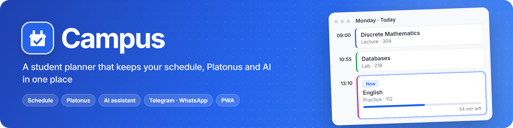
</p>

<p align="center">
  <a href="https://campus-planner.mymemory9.workers.dev"><b>Open Campus</b></a> ·
  <a href="#-quick-start">Install</a> ·
  <a href="docs/ARCHITECTURE.md">Architecture</a> ·
  <a href="#-api">API</a> ·
  <a href="https://github.com/ArabKustam/Campus/issues">Report a bug</a> ·
  <a href="README.md">🇷🇺 Русский</a>
</p>

<p align="center">
  <a href="https://campus-planner.mymemory9.workers.dev"></a>
  
  
  
  
  
</p>

**Campus** puts a student's university life in one window: a schedule that knows which class is on right now, grades and course materials from Platonus, assignments and files attached to each class, an AI assistant, and automatic parsing of your group's Telegram and WhatsApp chats. It runs in the browser and installs on your phone like an app.

<p align="center">
  <picture>
    <source media="(prefers-color-scheme: dark)" srcset="docs/images/hero-en-dark.gif">
    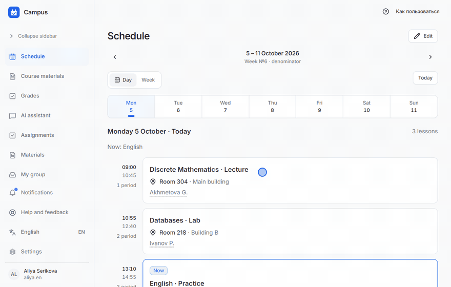
  </picture>
</p>

## ✨ Features

<picture><source media="(prefers-color-scheme: dark)" srcset="docs/images/feature-schedule-en-dark.png">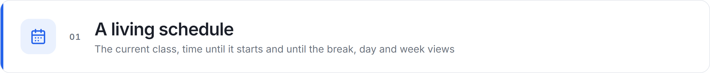</picture>

Campus knows what is happening right now. Before a class it shows **how long until it starts**. During a class it highlights the card, draws a progress bar and counts down **to the break**, and in the middle of a 105-minute pair it marks the **break** and when the class resumes. Between classes the next card counts down to its start. Day and week views, odd and even weeks, holidays and the academic week number are built in. Moves, cancellations and room changes apply to a single date and never break the regular timetable.

<p align="center"><picture><source media="(prefers-color-scheme: dark)" srcset="docs/images/live-en-dark.gif">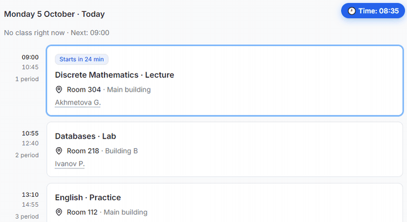</picture></p>

<p align="center"><sub>The same Monday at 08:35, 09:20, 09:52, 10:28 and 10:49. The time badge is added for the demo.</sub></p>

<picture><source media="(prefers-color-scheme: dark)" srcset="docs/images/schedule-week-en-dark.png">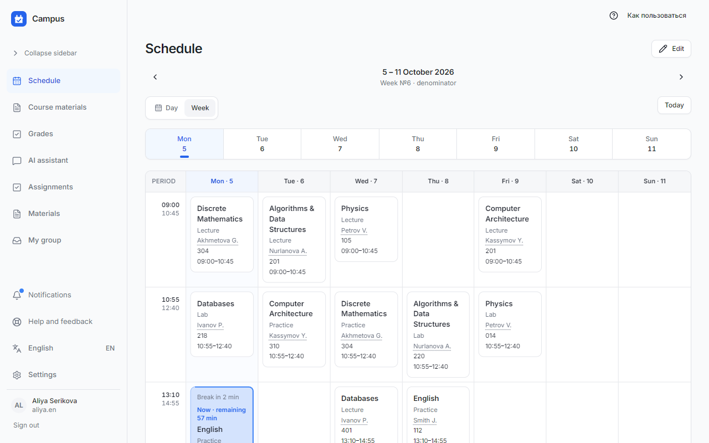</picture>

<picture><source media="(prefers-color-scheme: dark)" srcset="docs/images/feature-grades-en-dark.png">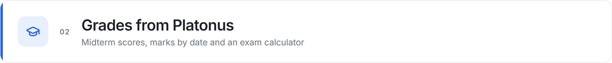</picture>

On first sign-in your Platonus login is all it takes: Campus imports the schedule, the journal and course materials, then keeps them up to date. The grades page shows each subject’s score, midterms, rating and exam, plus every mark by date with an average. The calculator tells you what you need on the exam for the grade you want, and the formula can be adjusted to your syllabus. New and changed grades show up in notifications.

<picture><source media="(prefers-color-scheme: dark)" srcset="docs/images/grades-en-dark.png">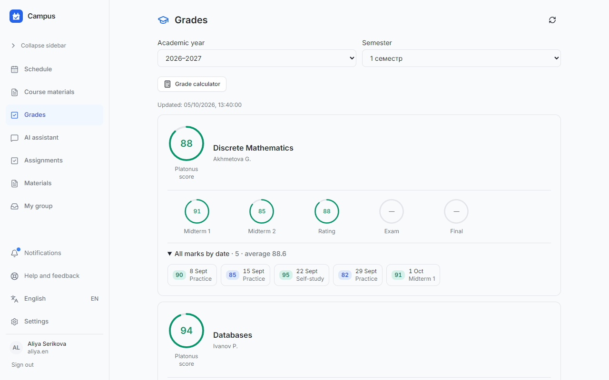</picture>

<table>
  <tr>
    <td width="50%"><picture><source media="(prefers-color-scheme: dark)" srcset="docs/images/grade-calc-en-dark.png">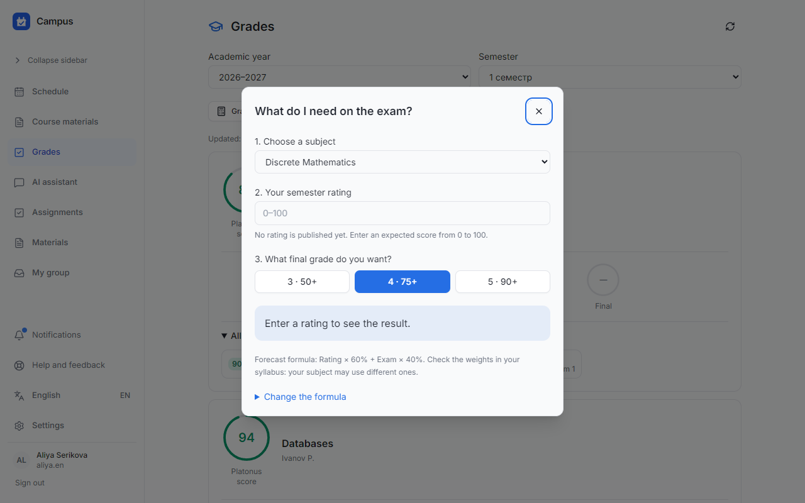</picture></td>
    <td width="50%">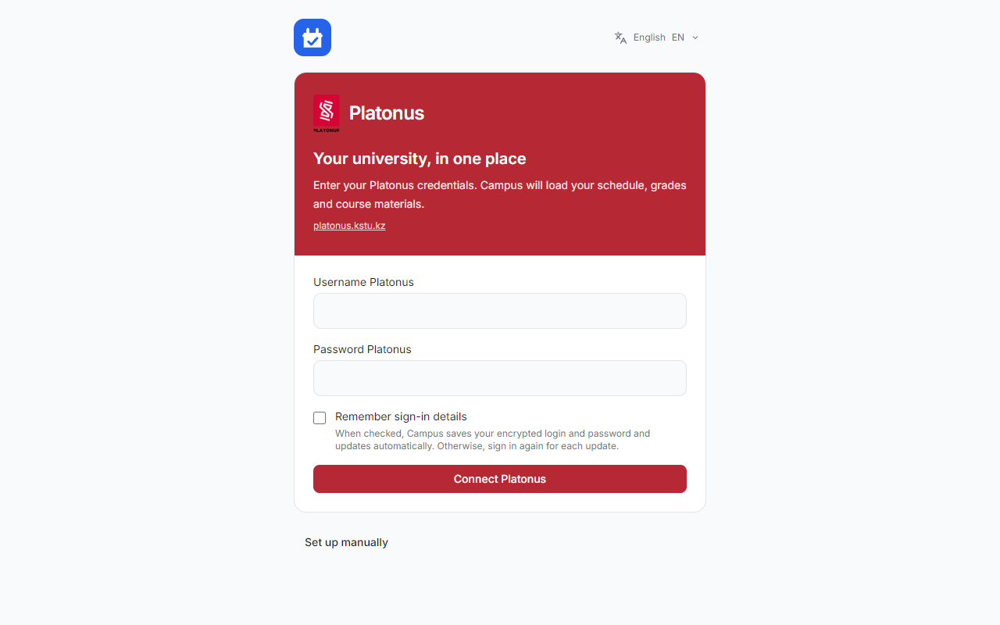</td>
  </tr>
</table>

<picture><source media="(prefers-color-scheme: dark)" srcset="docs/images/feature-umkd-en-dark.png">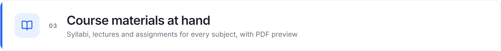</picture>

Course materials (UMKD) from Platonus are grouped by subject, with search, favourites and cards for the syllabus, lectures, seminars and exams. Documents open right inside Campus in the built-in PDF viewer, can be downloaded, and saved copies keep their versions.

<table>
  <tr>
    <td width="50%"><picture><source media="(prefers-color-scheme: dark)" srcset="docs/images/umkd-files-en-dark.png">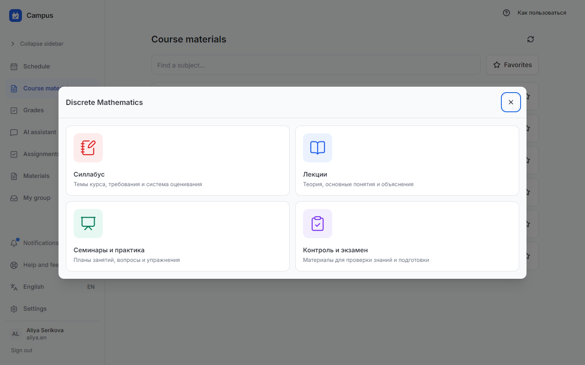</picture></td>
    <td width="50%"><picture><source media="(prefers-color-scheme: dark)" srcset="docs/images/umkd-pdf-en-dark.png">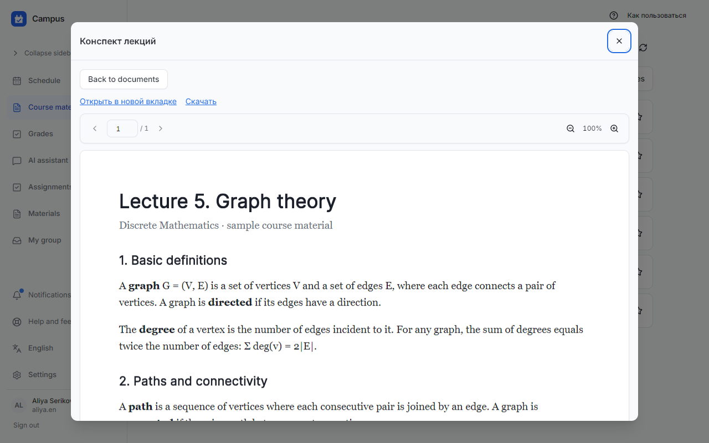</picture></td>
  </tr>
</table>

<picture><source media="(prefers-color-scheme: dark)" srcset="docs/images/feature-ai-en-dark.png">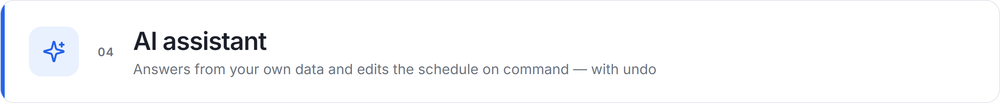</picture>

Ask “What do I have tomorrow?” or “How many points am I short of 90?” and the assistant answers from your schedule, assignments and grades. You can also give it tasks, such as “Cancel the first class on Friday in two weeks” or “Calculus homework: problems 1–5 for the next class”. If a request is ambiguous it asks a follow-up, and every action it takes has an undo button. Send it a photo of the whiteboard, a screenshot or a PDF and it reads the file and attaches it to the right class.

<picture><source media="(prefers-color-scheme: dark)" srcset="docs/images/assistant-en-dark.png">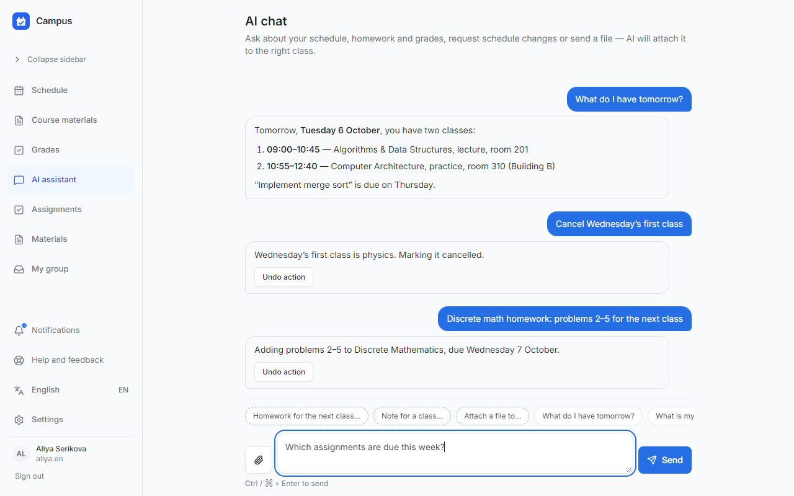</picture>

<sub>The screenshot shows a sample conversation inserted without calling the model: the phrases come from Campus’ built-in tutorial, and the schedule answer is based on the demo week.</sub>

<picture><source media="(prefers-color-scheme: dark)" srcset="docs/images/feature-chats-en-dark.png">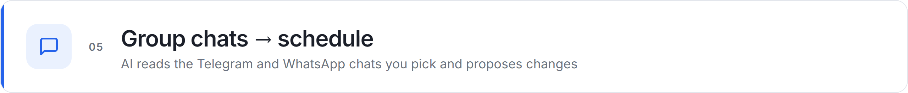</picture>

A small connector on your computer links to Telegram and WhatsApp by QR code, like any other linked device. Campus receives messages **only from the chats you pick**. AI turns “no first class tomorrow” or “the lab moves to room 420” into proposed schedule changes. Each proposal is checked for subject, date, conflicts and model confidence. Only the action types you allow are applied automatically; everything else waits for your approval on the Processing page.

- QR sign-in, sessions stay on your machine
- Messages from unselected chats are rejected before they reach the server
- Every applied change keeps its source message and can be reverted

<picture><source media="(prefers-color-scheme: dark)" srcset="docs/images/feature-tasks-en-dark.png">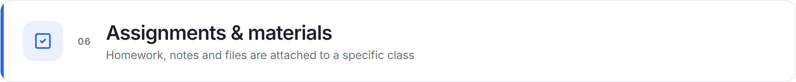</picture>

Add homework straight from a class card: for this class, the next one or any date. Notes, links and files (photos, PDFs, documents) live with the specific lesson too. All assignments and deadlines are collected on one page.

<table>
  <tr>
    <td width="50%"><picture><source media="(prefers-color-scheme: dark)" srcset="docs/images/lesson-en-dark.png">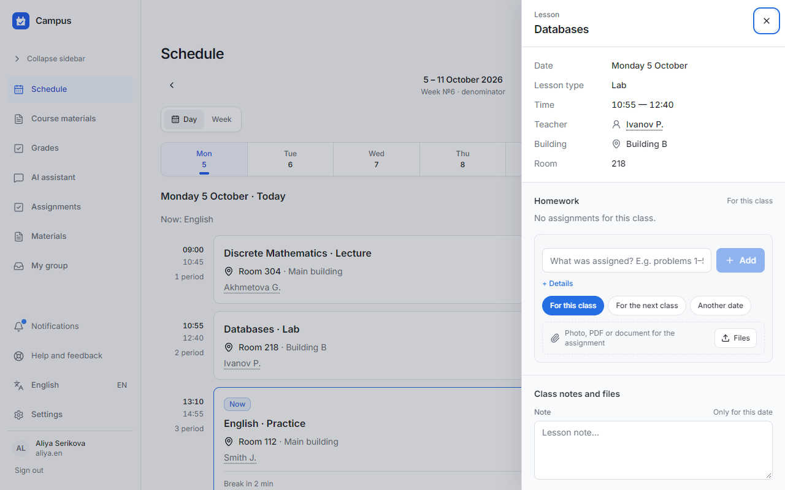</picture></td>
    <td width="50%"><picture><source media="(prefers-color-scheme: dark)" srcset="docs/images/tasks-en-dark.png">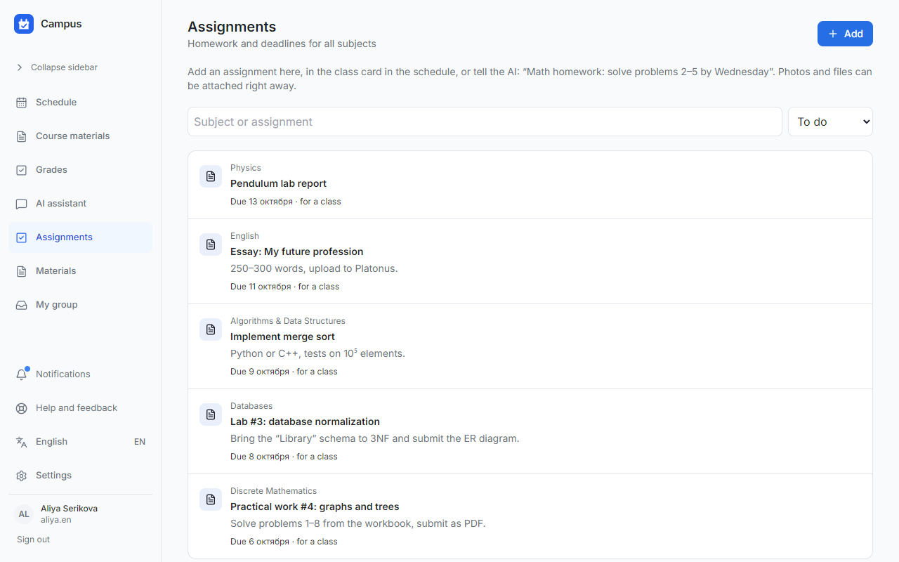</picture></td>
  </tr>
</table>

<picture><source media="(prefers-color-scheme: dark)" srcset="docs/images/feature-admin-en-dark.png">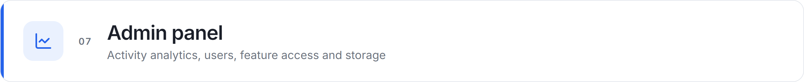</picture>

The site owner unlocks the admin panel with a one-time code sent to Telegram; access lasts 10 minutes. Analytics shows DAU, WAU and MAU, who is online, new accounts, Platonus connections and daily activity. Users has search and filters by Platonus and group, lets you turn features on per account (AI, groups, messengers, assignments) and delete accounts. Storage shows how much space the data takes. Most of the admin panel is in Russian for now.

<picture><source media="(prefers-color-scheme: dark)" srcset="docs/images/admin-analytics-en-dark.png">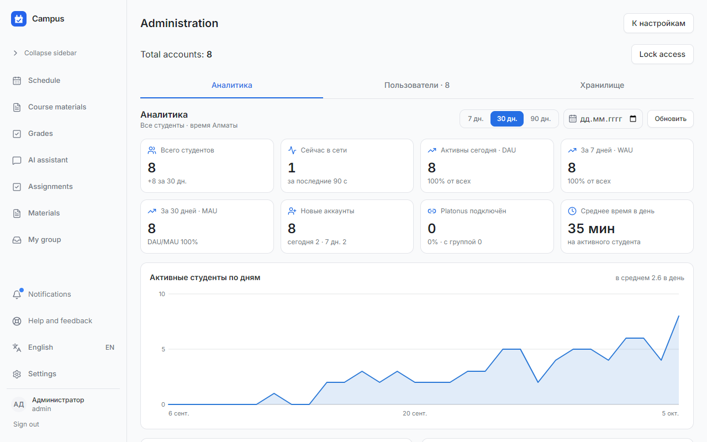</picture>

<picture><source media="(prefers-color-scheme: dark)" srcset="docs/images/admin-users-en-dark.png">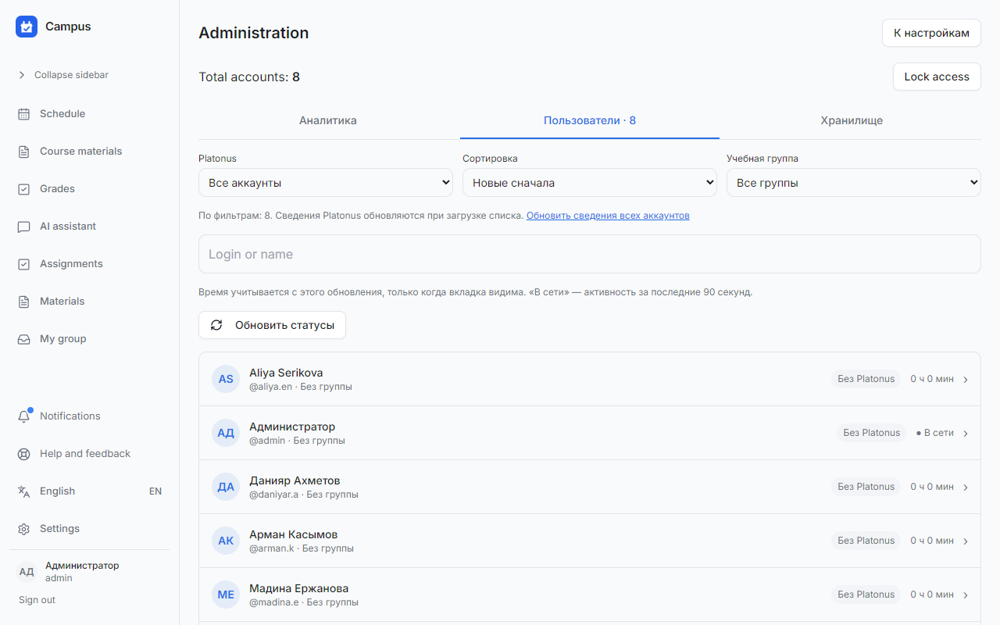</picture>

<sub>Users and activity history in the screenshots are demo accounts in a local database.</sub>

<picture><source media="(prefers-color-scheme: dark)" srcset="docs/images/feature-group-en-dark.png">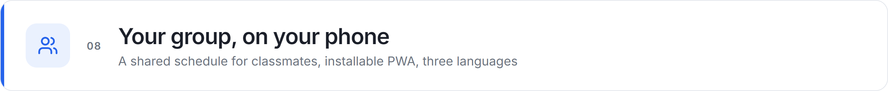</picture>

The group leader creates a group and shares an invite link. Classmates get a shared schedule, assignments and course materials, with roles (leader, deputy, member) and subgroups. Campus installs as a PWA, follows your light or dark theme, and the interface is available in Russian, English and Kazakh.

<table>
  <tr>
    <td width="50%"><picture><source media="(prefers-color-scheme: dark)" srcset="docs/images/mobile-en-dark.png">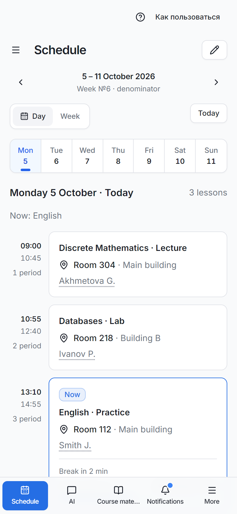</picture></td>
    <td width="50%"><picture><source media="(prefers-color-scheme: dark)" srcset="docs/images/mobile-menu-en-dark.png">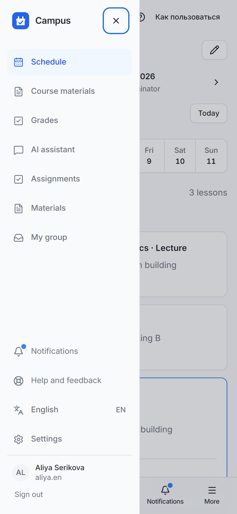</picture></td>
  </tr>
</table>

## 🧭 How it works

<picture>
  <source media="(prefers-color-scheme: dark)" srcset="docs/images/how-it-works-en-dark.png">
  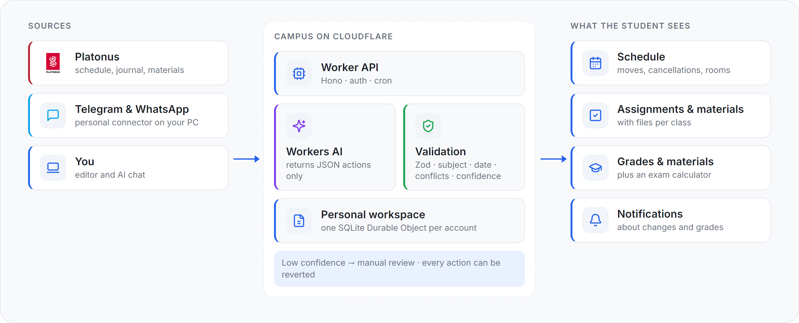
</picture>

- **Frontend:** React 19, TypeScript, Tailwind CSS, Vite, PWA.
- **Backend:** a Cloudflare Worker built on Hono. Accounts and sessions live in D1, and each user's data lives in their own SQLite Durable Object.
- **AI:** Workers AI returns structured JSON actions only (`ADD_HOMEWORK`, `CANCEL_LESSON`, `MOVE_LESSON`, `CHANGE_ROOM` …). They are validated by Zod and then by business rules. The model never sees SQL and never writes to the database.
- **Connector** (`bridge/`): a local Node.js process for Telegram (MTProto) and WhatsApp Web. Messenger sessions stay on your computer.

The processing pipeline, context limits and the legacy backend are documented in [docs/ARCHITECTURE.md](docs/ARCHITECTURE.md) (in Russian).

## 📋 Requirements

- Node.js 22 LTS or newer
- To deploy: a Cloudflare account (Workers, D1, Durable Objects, Workers AI)
- For the messenger connector: a computer that stays on, plus your own API ID/API Hash from [my.telegram.org/apps](https://my.telegram.org/apps) for Telegram

## 🚀 Quick start

The hosted version runs at **[campus-planner.mymemory9.workers.dev](https://campus-planner.mymemory9.workers.dev)**. Create an account and connect Platonus.

Run it locally:

```bash
git clone https://github.com/ArabKustam/Campus.git
cd Campus
npm install
npm run build:client
npm run db:migrate:local
npx wrangler d1 execute campus-db --local --file account-migrations/0002_groups.sql
npm run dev
```

Open http://localhost:5173. Vite proxies `/api` to Wrangler (`127.0.0.1:8787`). New accounts don't get AI, groups, messengers or assignments by default. The administrator (`ADMIN_ACCOUNT_ID`) turns them on in the admin panel.

Deploy to Cloudflare:

```bash
npm run db:migrate:remote
npm run deploy
```

Before deploying, put your resource IDs and `PUBLIC_APP_URL` into `wrangler.production.jsonc` and set secrets with `wrangler secret put`.

## ⚙️ Configuration

| Setting | Where | Purpose |
|---|---|---|
| `AI_MODEL` | `wrangler*.jsonc` → `vars` | Workers AI model for message parsing (default `@cf/google/gemma-4-26b-a4b-it`) |
| `ASSISTANT_MODEL` | `vars` | Separate model for the AI assistant (optional) |
| `PUBLIC_APP_URL` | `vars` | Public site URL, used for invites and Origin checks |
| `CREDENTIALS_ENCRYPTION_KEY` | secret | Encrypts saved Platonus credentials |
| `ADMIN_ACCOUNT_ID` | secret / `vars` | Administrator account: admin panel and feature access |
| `WHATSAPP_BRIDGE_SECRET` | secret | Shared secret between the Worker and the connector |
| `CAMPUS_APP_URL` | `bridge/.env` | The site the connector accepts requests from |
| `automation.minimumConfidence`, `automation.autoApply` | Settings → Automation | Confidence threshold and which action types AI may apply on its own |

## 🛠 Commands

| Command | What it does |
|---|---|
| `npm run dev` | Worker + Vite with hot reload |
| `npm run build` | Type checks, frontend build, Worker dry run |
| `npm test` | Worker, frontend and legacy tests |
| `npm run lint` | oxlint |
| `npm run db:migrate:local` / `:remote` | D1 migrations |
| `npm run deploy` | Build and publish with `wrangler.production.jsonc` |
| `npm run connector` | Start the local messenger connector |

To run the connector on another computer, download it in the app: **Settings → Telegram/WhatsApp → How to run the connector**. Unzip it and run `npm ci && npm start` ([guide, in Russian](bridge/README.md)).

## 🔌 API

Every request runs as the signed-in user (cookie session). Requests that change data need the `X-Campus-Request: 1` header.

```js
// Schedule for a given day
const day = await fetch('/api/schedule/day?date=2026-10-05').then(r => r.json())

// New assignment for a class
await fetch('/api/homework', {
  method: 'POST',
  headers: {'content-type': 'application/json', 'x-campus-request': '1'},
  body: JSON.stringify({
    subjectId: 'subject-id',
    scheduleSlotId: 'slot-id',
    title: 'Lab #3: database normalization',
    dueAt: '2026-10-08T23:59:00+05:00',
  }),
})
```

| Method | Path | Description |
|---|---|---|
| `GET` | `/api/schedule?from=&to=` · `/api/schedule/day?date=` | Schedule with moves and cancellations applied |
| `GET/POST/PATCH` | `/api/catalog/{subjects,teachers,slots}` | Subjects, teachers, regular classes |
| `GET/POST/PATCH` | `/api/homework` · `/api/materials` | Assignments and materials |
| `POST` | `/api/processing/run` | Start AI parsing of new messages (202) |
| `POST` | `/api/actions/:id/{apply,reject,revert}` | AI proposal lifecycle |

## ❓ FAQ

<details>
<summary><b>Does Campus store my Platonus password?</b></summary>

Only if you tick “Remember sign-in details”. In that case the login and password are stored encrypted (`CREDENTIALS_ENCRYPTION_KEY`) and data refreshes automatically. Without it, every refresh needs a new sign-in.
</details>

<details>
<summary><b>Which universities are supported?</b></summary>

The Platonus address is currently set to `platonus.kstu.kz` (`worker/services/platonus-api.ts`). For another university on Platonus, change `PLATONUS_ORIGIN` and check the page parsing. Without Platonus you can keep the schedule by hand: choose “Set up manually” on first sign-in.
</details>

<details>
<summary><b>Which messages does the AI see?</b></summary>

Only messages from the chats selected in settings, starting from 30 August 2026. The text is processed by Cloudflare Workers AI. Private chats and unselected groups are rejected before anything is sent to the server.
</details>

<details>
<summary><b>Does the connector have to keep running?</b></summary>

Yes. It's a regular program on your computer, not a cloud service. While it's closed, new messages aren't synced. Running `npm start` again resumes the saved connections.
</details>

## 💬 Support

- Bugs and ideas: [GitHub Issues](https://github.com/ArabKustam/Campus/issues)
- In the app: **Help and feedback** in the sidebar

## 📄 License

No license file has been added yet, so all rights are reserved by the author.

<sub>README images are built by the scripts in [`docs/assets-src`](docs/assets-src). Screenshots and GIFs are captured from the app running locally with a demo week. Grades, course materials and the AI conversation in the screenshots are sample data from [`demo-data.mjs`](docs/assets-src/demo-data.mjs), since real ones need a Platonus account and Workers AI. The banner and diagram are rendered from HTML.</sub>
