<p align="center">
  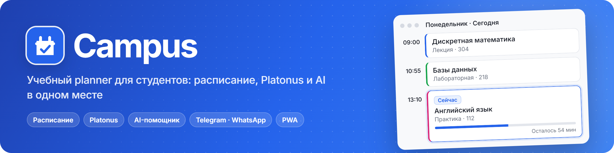
</p>

<p align="center">
  <a href="https://campus-planner.mymemory9.workers.dev"><b>Открыть Campus</b></a> ·
  <a href="#-быстрый-старт">Установка</a> ·
  <a href="docs/ARCHITECTURE.md">Архитектура</a> ·
  <a href="#-api">API</a> ·
  <a href="https://github.com/ArabKustam/Campus/issues">Сообщить об ошибке</a> ·
  <a href="README.md">🇬🇧 English</a>
</p>

<p align="center">
  <a href="https://campus-planner.mymemory9.workers.dev"></a>
  
  
  
  
  
</p>

**Campus** собирает учебную жизнь студента в одном окне: расписание с текущей парой, оценки и УМКД из Platonus, задания и файлы к каждому занятию, AI-помощника и автоматический разбор чатов группы в Telegram и WhatsApp. Работает в браузере и устанавливается на телефон как приложение.

<p align="center">
  <picture>
    <source media="(prefers-color-scheme: dark)" srcset="docs/images/hero-ru-dark.gif">
    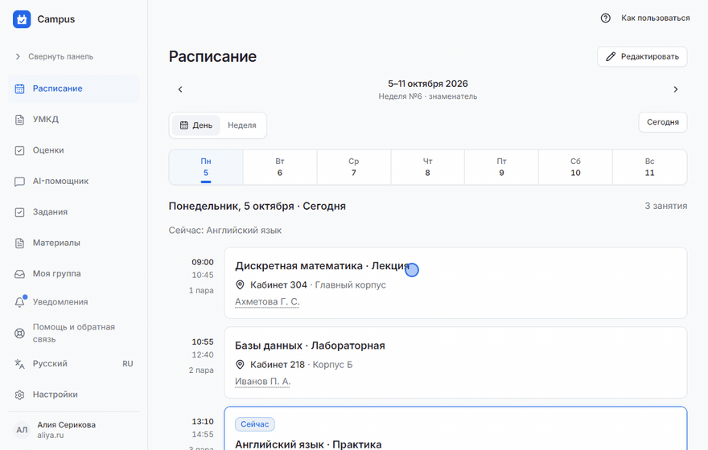
  </picture>
</p>

## ✨ Возможности

<picture>
  <source media="(prefers-color-scheme: dark)" srcset="docs/images/feature-schedule-ru-dark.png">
  
</picture>

Вид дня и недели, числитель и знаменатель, праздники и номер учебной недели. Текущая пара подсвечивается, показывает прогресс и время до перемены. Переносы, отмены и смена кабинета применяются к конкретной дате и не ломают регулярный шаблон.

<picture>
  <source media="(prefers-color-scheme: dark)" srcset="docs/images/schedule-week-ru-dark.png">
  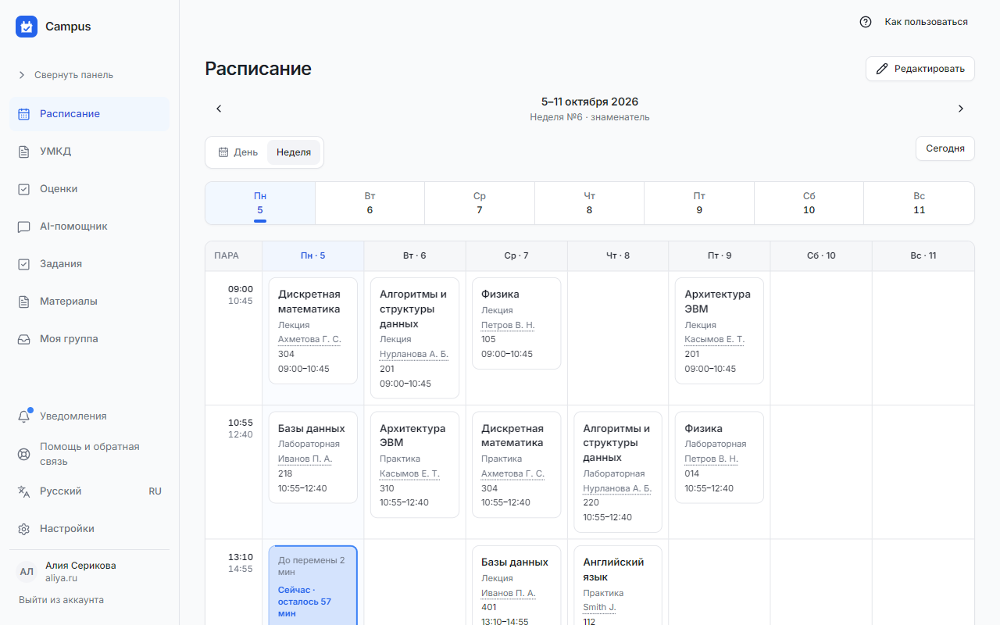
</picture>

<picture>
  <source media="(prefers-color-scheme: dark)" srcset="docs/images/feature-platonus-ru-dark.png">
  
</picture>

При первом входе достаточно логина Platonus: Campus загрузит расписание, оценки из журнала и учебные материалы (УМКД) и дальше будет обновлять их сам. Калькулятор подскажет, сколько баллов нужно на экзамене для желаемой оценки. Формулу расчёта можно изменить под силлабус.

<table>
  <tr>
    <td width="50%">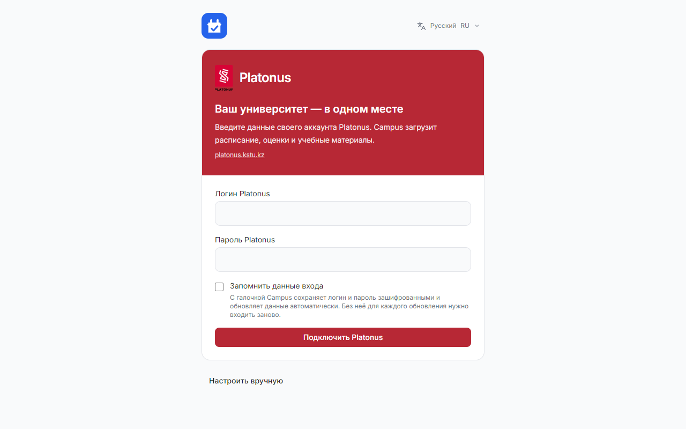</td>
    <td width="50%"><picture><source media="(prefers-color-scheme: dark)" srcset="docs/images/grades-ru-dark.png">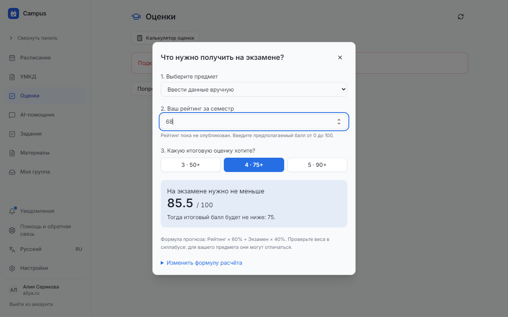</picture></td>
  </tr>
</table>

<picture>
  <source media="(prefers-color-scheme: dark)" srcset="docs/images/feature-ai-ru-dark.png">
  
</picture>

Спросите «Что у меня завтра?» или «Сколько баллов не хватает до 90?». Помощник отвечает по вашему расписанию, заданиям и оценкам. Можно и поручить: «Отмени первую пару в пятницу через две недели» или «ДЗ по матанализу: задачи 1–5 к следующей паре». Если запрос неоднозначный, помощник уточнит, а любое выполненное действие можно отменить. Фото доски, скриншот или PDF он прочитает и прикрепит к нужному занятию.

<picture>
  <source media="(prefers-color-scheme: dark)" srcset="docs/images/assistant-ru-dark.png">
  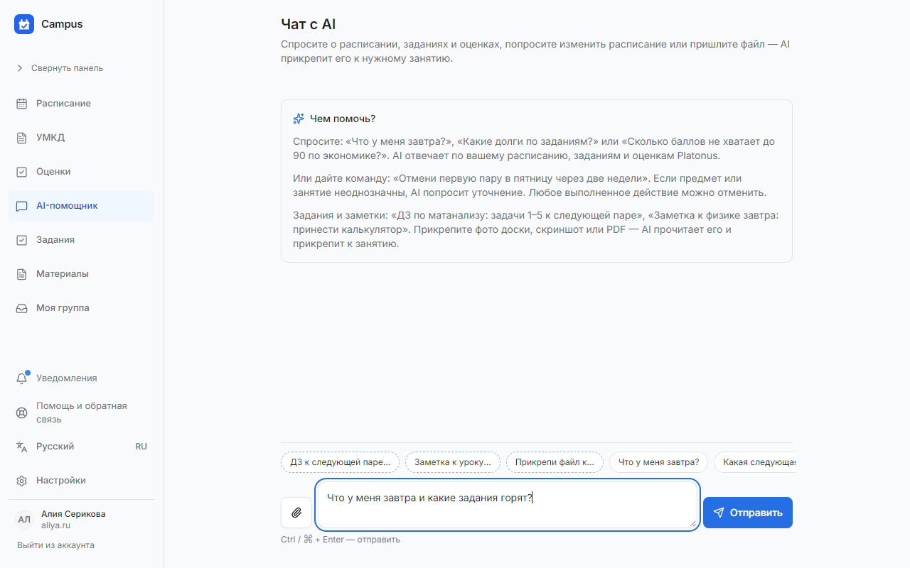
</picture>

<picture>
  <source media="(prefers-color-scheme: dark)" srcset="docs/images/feature-chats-ru-dark.png">
  
</picture>

Небольшой коннектор на вашем компьютере подключается к Telegram и WhatsApp по QR-коду, как обычное связанное устройство. Campus получает сообщения **только из чатов, которые вы выбрали**. AI превращает «завтра первой пары не будет» и «лаба переносится в 420» в предложения изменить расписание. Каждое предложение проверяется: предмет, дата, конфликты, уверенность модели. Автоматически применяется только то, что вы разрешили. Остальное ждёт подтверждения в разделе «Обработка».

<picture>
  <source media="(prefers-color-scheme: dark)" srcset="docs/images/messengers-ru-dark.png">
  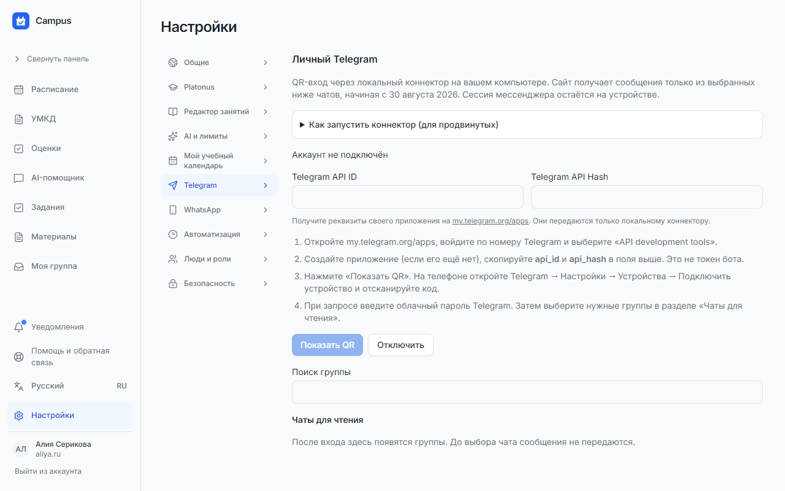
</picture>

<picture>
  <source media="(prefers-color-scheme: dark)" srcset="docs/images/feature-tasks-ru-dark.png">
  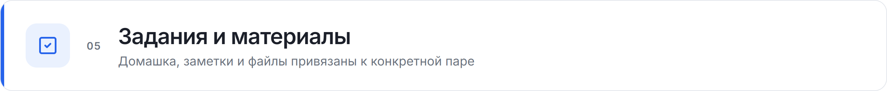
</picture>

Домашнее задание добавляется прямо из карточки занятия к этой паре, к следующей или на любую дату. Заметки, ссылки и файлы (фото, PDF, документы) тоже живут у конкретного урока. Все задания со сроками собраны на одной странице.

<table>
  <tr>
    <td width="50%"><picture><source media="(prefers-color-scheme: dark)" srcset="docs/images/lesson-ru-dark.png">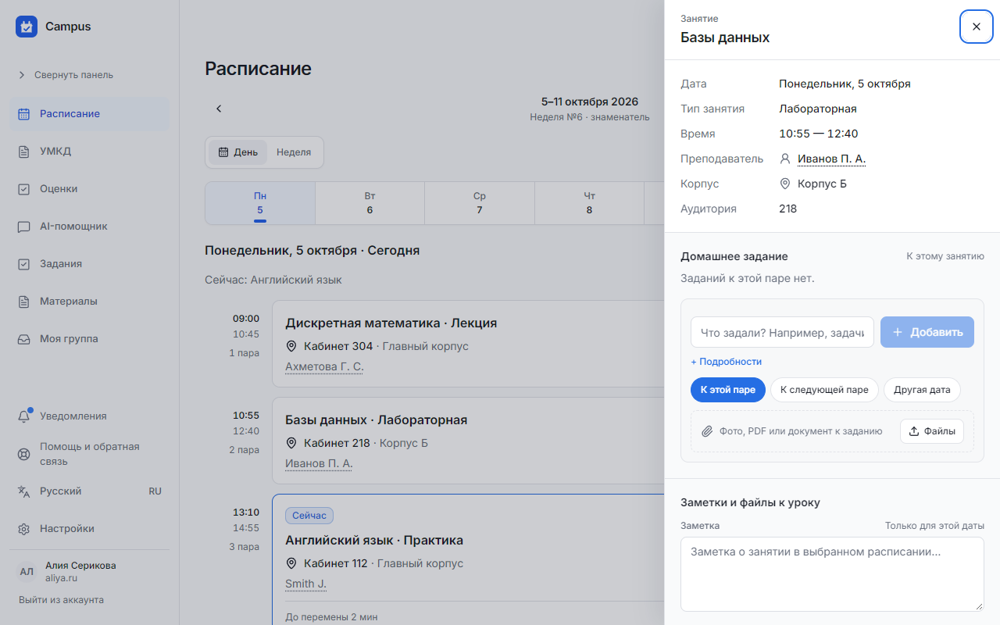</picture></td>
    <td width="50%"><picture><source media="(prefers-color-scheme: dark)" srcset="docs/images/tasks-ru-dark.png">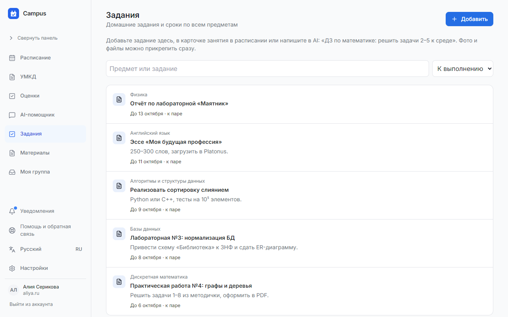</picture></td>
  </tr>
</table>

<picture>
  <source media="(prefers-color-scheme: dark)" srcset="docs/images/feature-group-ru-dark.png">
  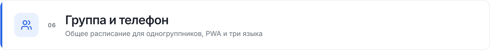
</picture>

Староста создаёт группу и рассылает ссылку-приглашение. Одногруппники получают общее расписание, задания и УМКД, а роли (староста, заместитель, участник) и подгруппы задаются в группе. Campus устанавливается на телефон как PWA, поддерживает светлую и тёмную тему, а интерфейс доступен на русском, английском и казахском.

<table>
  <tr>
    <td width="25%"><picture><source media="(prefers-color-scheme: dark)" srcset="docs/images/mobile-ru-dark.png">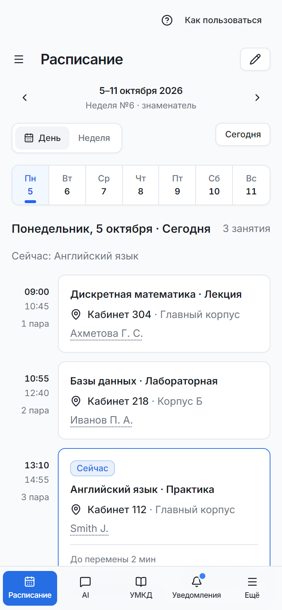</picture></td>
    <td width="25%"><picture><source media="(prefers-color-scheme: dark)" srcset="docs/images/mobile-menu-ru-dark.png">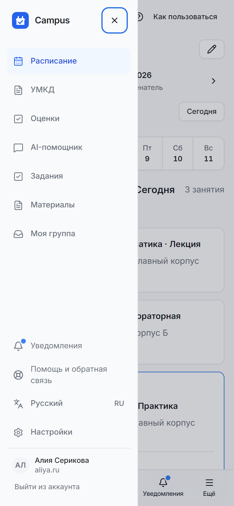</picture></td>
    <td width="50%"><picture><source media="(prefers-color-scheme: dark)" srcset="docs/images/group-ru-dark.png">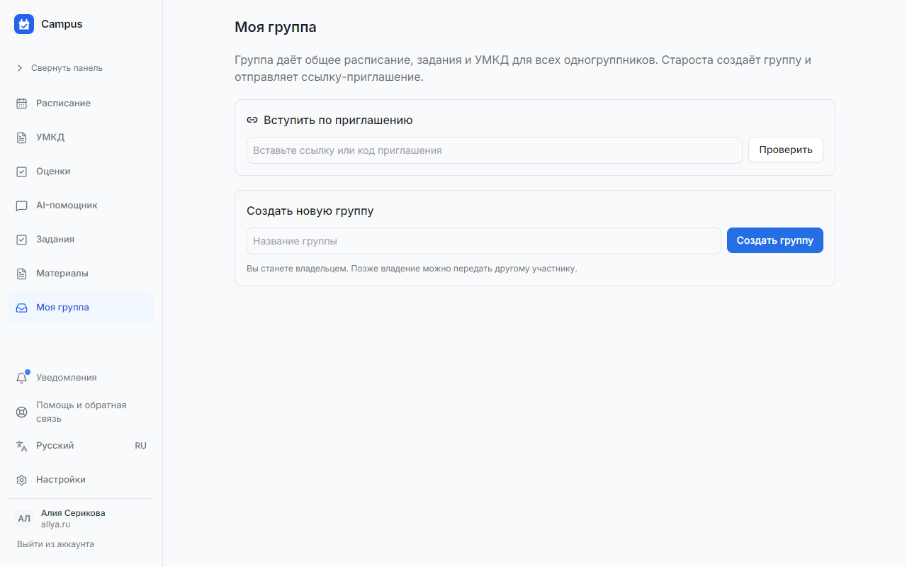</picture></td>
  </tr>
</table>

## 🧭 Как это работает

<picture>
  <source media="(prefers-color-scheme: dark)" srcset="docs/images/how-it-works-ru-dark.png">
  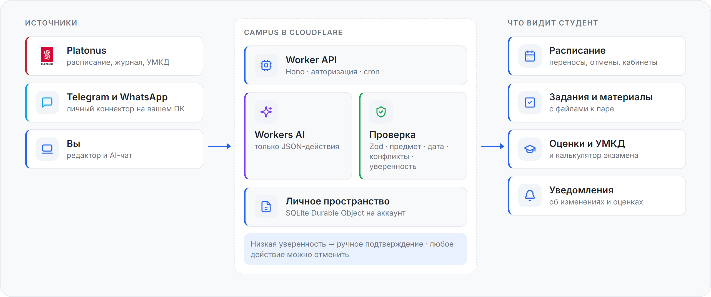
</picture>

- **Frontend:** React 19, TypeScript, Tailwind CSS, Vite, PWA.
- **Backend:** Cloudflare Worker на Hono. Аккаунты и сессии хранятся в D1, данные каждого пользователя в отдельном SQLite Durable Object.
- **AI:** Workers AI возвращает только структурированные JSON-действия (`ADD_HOMEWORK`, `CANCEL_LESSON`, `MOVE_LESSON`, `CHANGE_ROOM` …). Их проверяет Zod, затем бизнес-правила. Модель не получает SQL и не пишет в базу напрямую.
- **Коннектор** (`bridge/`): локальный Node.js-процесс для Telegram (MTProto) и WhatsApp Web. Сессии мессенджеров остаются на вашем компьютере.

Подробности пайплайна, лимиты контекста и legacy backend описаны в [docs/ARCHITECTURE.md](docs/ARCHITECTURE.md).

## 📋 Требования

- Node.js 22 LTS или новее
- Для публикации: аккаунт Cloudflare (Workers, D1, Durable Objects, Workers AI)
- Для коннектора мессенджеров: компьютер, который остаётся включённым, и собственные API ID/API Hash с [my.telegram.org/apps](https://my.telegram.org/apps) для Telegram

## 🚀 Быстрый старт

Готовая версия работает по адресу **[campus-planner.mymemory9.workers.dev](https://campus-planner.mymemory9.workers.dev)**: создайте аккаунт и подключите Platonus.

Локальный запуск:

```bash
git clone https://github.com/ArabKustam/Campus.git
cd Campus
npm install
npm run build:client
npm run db:migrate:local
npx wrangler d1 execute campus-db --local --file account-migrations/0002_groups.sql
npm run dev
```

Откройте http://localhost:5173. Vite проксирует `/api` на Wrangler (`127.0.0.1:8787`). Новым аккаунтам по умолчанию недоступны AI, группы, мессенджеры и задания: их открывает администратор (`ADMIN_ACCOUNT_ID`) в админ-панели.

Публикация в Cloudflare:

```bash
npm run db:migrate:remote
npm run deploy
```

Перед этим укажите свои ID ресурсов и `PUBLIC_APP_URL` в `wrangler.production.jsonc` и задайте секреты через `wrangler secret put`.

## ⚙️ Настройка

| Параметр | Где | Назначение |
|---|---|---|
| `AI_MODEL` | `wrangler*.jsonc` → `vars` | Модель Workers AI для разбора сообщений (по умолчанию `@cf/google/gemma-4-26b-a4b-it`) |
| `ASSISTANT_MODEL` | `vars` | Отдельная модель для AI-помощника (необязательно) |
| `PUBLIC_APP_URL` | `vars` | Публичный адрес сайта, нужен для приглашений и проверки Origin |
| `CREDENTIALS_ENCRYPTION_KEY` | секрет | Ключ шифрования сохранённых данных входа в Platonus |
| `ADMIN_ACCOUNT_ID` | секрет / `vars` | ID аккаунта администратора: доступ к админ-панели и выдаче функций |
| `WHATSAPP_BRIDGE_SECRET` | секрет | Общий секрет Worker ↔ коннектор |
| `CAMPUS_APP_URL` | `bridge/.env` | Сайт, от которого коннектор принимает запросы |
| `automation.minimumConfidence`, `automation.autoApply` | Настройки → Автоматизация | Порог уверенности и типы действий, которые AI может применять сам |

## 🛠 Команды

| Команда | Что делает |
|---|---|
| `npm run dev` | Worker + Vite с hot reload |
| `npm run build` | Проверка типов, сборка frontend, dry-run Worker |
| `npm test` | Тесты Worker, frontend и legacy |
| `npm run lint` | oxlint |
| `npm run db:migrate:local` / `:remote` | Миграции D1 |
| `npm run deploy` | Сборка и публикация через `wrangler.production.jsonc` |
| `npm run connector` | Запуск локального коннектора мессенджеров |

Коннектор для другого компьютера скачивается в приложении: **Настройки → Telegram/WhatsApp → Как запустить коннектор**. Затем распакуйте архив и выполните `npm ci && npm start` ([инструкция](bridge/README.md)).

## 🔌 API

Все запросы идут от имени вошедшего пользователя (cookie-сессия). Изменяющие запросы требуют заголовок `X-Campus-Request: 1`.

```js
// Расписание на конкретный день
const day = await fetch('/api/schedule/day?date=2026-10-05').then(r => r.json())

// Новое задание к занятию
await fetch('/api/homework', {
  method: 'POST',
  headers: {'content-type': 'application/json', 'x-campus-request': '1'},
  body: JSON.stringify({
    subjectId: 'subject-id',
    scheduleSlotId: 'slot-id',
    title: 'Лабораторная №3: нормализация БД',
    dueAt: '2026-10-08T23:59:00+05:00',
  }),
})
```

| Метод | Путь | Описание |
|---|---|---|
| `GET` | `/api/schedule?from=&to=` · `/api/schedule/day?date=` | Расписание с учётом переносов и отмен |
| `GET/POST/PATCH` | `/api/catalog/{subjects,teachers,slots}` | Предметы, преподаватели, регулярные пары |
| `GET/POST/PATCH` | `/api/homework` · `/api/materials` | Задания и материалы |
| `POST` | `/api/processing/run` | Запуск AI-разбора новых сообщений (202) |
| `POST` | `/api/actions/:id/{apply,reject,revert}` | Жизненный цикл AI-предложения |

## ❓ FAQ

<details>
<summary><b>Хранит ли Campus мой пароль от Platonus?</b></summary>

Только если отметить «Запомнить данные входа». Тогда логин и пароль сохраняются зашифрованными (`CREDENTIALS_ENCRYPTION_KEY`), и данные обновляются автоматически. Без галочки для каждого обновления нужно входить заново.
</details>

<details>
<summary><b>С какими университетами работает интеграция?</b></summary>

Сейчас адрес Platonus задан как `platonus.kstu.kz` (`worker/services/platonus-api.ts`). Для другого вуза на Platonus нужно поменять `PLATONUS_ORIGIN` и проверить разбор страниц. Без Platonus расписание можно вести вручную: нажмите «Настроить вручную» при первом входе.
</details>

<details>
<summary><b>Какие сообщения видит AI?</b></summary>

Только из чатов, выбранных в настройках, и начиная с 30 августа 2026 года. Тексты обрабатывает Cloudflare Workers AI. Личные переписки и невыбранные группы отклоняются ещё до отправки на сервер.
</details>

<details>
<summary><b>Нужно ли держать коннектор включённым?</b></summary>

Да. Это обычная программа на вашем компьютере, а не облачный сервис. Пока она закрыта, новые сообщения не синхронизируются. Повторный `npm start` продолжит сохранённые подключения.
</details>

## 💬 Поддержка

- Ошибки и предложения: [GitHub Issues](https://github.com/ArabKustam/Campus/issues)
- В приложении: **Помощь и обратная связь** в боковом меню

## 📄 Лицензия

Файл лицензии пока не добавлен, поэтому все права принадлежат автору.

<sub>Картинки для README собираются скриптами в [`docs/assets-src`](docs/assets-src): скриншоты снимаются с локально запущенного приложения, а баннер и схема рендерятся из HTML.</sub>
